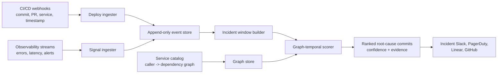

# Incident Attribution System

This system attributes production incidents to recent deploys across a microservice graph. The production implementation exposes a typed backend scoring endpoint and keeps the scorer deterministic, replayable, and auditable.

## Architecture



Core runtime path:

1. Deploy ingester normalizes deploy webhooks into immutable `DeployEvent` records.
2. Signal ingester normalizes alerts and metric anomalies into `ObservabilitySignal` records.
3. Incident window builder groups signals by time and affected service. A production version should use alert IDs when available, then fall back to a rolling time window.
4. Candidate retriever loads deploys in the configured lookback window before the incident, defaulting to 6 hours. The current endpoint accepts these normalized deploys directly; a persistent ingester can be placed behind the same service later.
5. Scorer computes a posterior distribution over candidate commits plus an explicit `unknown` bucket.
6. Output includes ranked commits, confidence, and per-signal evidence so responders can audit the ranking.

Operational shape:

- Event stores should be append-only and idempotent by provider event ID.
- Scoring jobs should be replayable from event history.
- The service graph should be versioned by timestamp, since topology changes can otherwise rewrite historical attribution.
- Confidence must be treated as a decision aid, not as an automatic rollback command.

## Production API

`POST /api/incident-attribution/rank`

Auth:

- Requires authenticated API, session, or bearer access in the active `/api` server.
- Scores only request-supplied normalized data; it does not mutate incident, deploy, or signal state.
- The modular app route uses the existing organization guards, CSRF guard, and stricter triage limiter.

Minimal request:

```json
{
  "incidentId": "inc-2026-05-01-checkout-5xx",
  "primaryService": "checkout",
  "startedAt": "2026-05-01T13:18:00.000Z",
  "detectedAt": "2026-05-01T13:24:00.000Z",
  "deploys": [
    {
      "deployId": "dep-003",
      "commitHash": "cafe777",
      "pr": "PR-233",
      "service": "payments",
      "deployedAt": "2026-05-01T10:20:00.000Z"
    }
  ],
  "signals": [
    {
      "signalId": "sig-001",
      "service": "checkout",
      "timestamp": "2026-05-01T13:18:00.000Z",
      "kind": "error_rate",
      "severity": 0.96,
      "description": "checkout 5xx rate jumped from 0.2% to 14%"
    }
  ],
  "serviceDependencies": {
    "checkout": ["payments", "identity"],
    "api-gateway": ["checkout"]
  }
}
```

Response:

```json
{
  "incidentId": "inc-2026-05-01-checkout-5xx",
  "modelVersion": "graph-temporal-naive-bayes-v1",
  "unknownConfidence": 0.0082,
  "rankedCommits": [
    {
      "rank": 1,
      "commitHash": "cafe777",
      "pr": "PR-233",
      "service": "payments",
      "confidence": 0.4905,
      "topEvidence": []
    }
  ]
}
```

The TypeScript implementation is in [incident-attribution.service.ts](/Users/omer/Local_Repo/proxkey/frontend/server/src/services/incident-attribution.service.ts), with request validation in [incident-attribution.schemas.ts](/Users/omer/Local_Repo/proxkey/frontend/server/src/schemas/incident-attribution.schemas.ts). The active production server exposes it from [server.ts](/Users/omer/Local_Repo/proxkey/frontend/server/src/proxkey/server.ts); the modular route is also wired in [incident-attribution.routes.ts](/Users/omer/Local_Repo/proxkey/frontend/server/src/routes/incident-attribution.routes.ts).

## Data Schema

Logical schema:

```sql
create table deploy_events (
  deploy_id text primary key,
  service text not null,
  commit_hash text not null,
  pr text not null,
  deployed_at timestamptz not null,
  metadata jsonb not null default '{}'
);

create table observability_signals (
  signal_id text primary key,
  service text not null,
  ts timestamptz not null,
  kind text not null check (kind in ('error_rate', 'latency', 'alert', 'saturation')),
  severity double precision not null check (severity >= 0 and severity <= 1),
  description text not null,
  incident_id text
);

create table service_edges (
  from_service text not null,
  to_dependency_service text not null,
  valid_from timestamptz not null,
  valid_to timestamptz,
  primary key (from_service, to_dependency_service, valid_from)
);

create table attribution_results (
  result_id text primary key,
  incident_id text not null,
  scored_at timestamptz not null,
  unknown_confidence double precision not null,
  ranked_commits jsonb not null
);
```

The live endpoint is currently stateless and accepts normalized deploys, signals, and graph edges in the request body. The logical storage schema above is the intended persistent backing store when CI/CD and observability ingesters are added. The original dependency-free Python simulator remains available at [incident_attribution.py](/Users/omer/Local_Repo/proxkey/frontend/scripts/incident_attribution.py).

## Probabilistic Model

For each candidate deploy `c`, the scorer estimates:

```text
P(c | signals, graph) proportional to P(c) * product_i LR(signal_i | c, graph, lag)
```

Each signal likelihood ratio combines:

- temporal factor: a mixture of immediate and delayed exponential decay, capped at the max delay window
- graph factor: same service, changed dependency observed by caller, changed caller, connected service, or unconnected
- signal factor: kind weight multiplied by severity

The model uses a background probability so weak or unrelated evidence does not force a false positive. Final confidence is normalized with a softmax over candidates and an explicit `unknown` bucket. The `unknown` bucket also receives a small generic signal likelihood so the posterior does not collapse to a known commit just because several weakly correlated deploys exist.

Pseudo:

```text
candidates = deploys where any signal timestamp is within [deploy_at, deploy_at + max_delay]

for deploy in candidates:
    log_score = log(candidate_prior)
    log_score += graph_prior_boost(deploy.service, incident.primary_service)

    for signal in incident.signals:
        lag = signal.timestamp - deploy.deployed_at
        temporal = temporal_kernel(lag)
        graph = graph_kernel(deploy.service, signal.service)
        explained = temporal * graph.factor * kind_weight(signal.kind) * signal.severity
        lr = (background + (1 - background) * explained) / background
        log_score += (1 + signal.severity) * log(max(lr, 1))

unknown_score = log(unknown_prior) + generic_signal_likelihood(signals)
posterior = softmax(candidate_log_scores + [unknown_score])
return ranked candidate commits by posterior confidence
```

## Python Example

Run:

```bash
python3 frontend/scripts/incident_attribution.py
```

Production service tests:

```bash
cd frontend/server
npm run test -- incident-attribution.service.test.ts
```

The simulation creates five deploys:

- `identity` at 10:00
- `checkout` at 10:04
- `payments` at 10:20
- `search` at 12:45
- `notifications` at 13:00

One incident starts at 13:18 with `checkout`, `payments`, and `api-gateway` signals. The expected top candidate is the `payments` deploy because it is a direct dependency of `checkout`, it has its own error-rate signal, and the incident still falls inside the delayed-failure window.

Simulation output:

| Rank | Commit | PR | Service | Confidence |
| --- | --- | --- | --- | --- |
| 1 | `cafe777` | `PR-233` | `payments` | 0.4905 |
| 2 | `b00c042` | `PR-232` | `checkout` | 0.3234 |
| 3 | `deed404` | `PR-234` | `search` | 0.1046 |
| 4 | `a11ce01` | `PR-231` | `identity` | 0.0729 |
| 5 | `ee11e55` | `PR-235` | `notifications` | 0.0004 |
| - | `unknown` | - | - | 0.0082 |

## Tradeoffs

- Naive Bayes independence is simple and explainable, but correlated signals can overstate confidence. Production should deduplicate by alert policy, trace cluster, or metric family.
- Graph distance is a strong prior, but stale service topology will bias rankings. Version the graph and score against the incident timestamp.
- Temporal correlation is useful but not causal. High-risk deploy metadata, changed files, ownership, canary health, and rollback outcomes should become additional likelihood features.
- Concurrent deploys can split confidence among plausible commits. This is correct when evidence cannot distinguish them, but responders may also want service-level aggregation.
- Delayed failures require a long lookback window, which increases false positives. The explicit `unknown` bucket and graph factor reduce but do not remove that risk.

## Failure Modes

- Missing deploy event: the true root cause goes to `unknown` or an adjacent service.
- Missing signal on the root service: symptoms may rank the caller service too highly.
- Broad platform incident: many services fire, causing graph proximity to become less informative.
- Shared libraries or config pushes: a commit can affect many services without appearing in the service graph.
- Time skew between CI/CD and observability sources: small skew is tolerated, large skew should be corrected at ingestion.
- Auto-remediation or retries hide the first failing signal, making the temporal kernel point at a later deploy.
